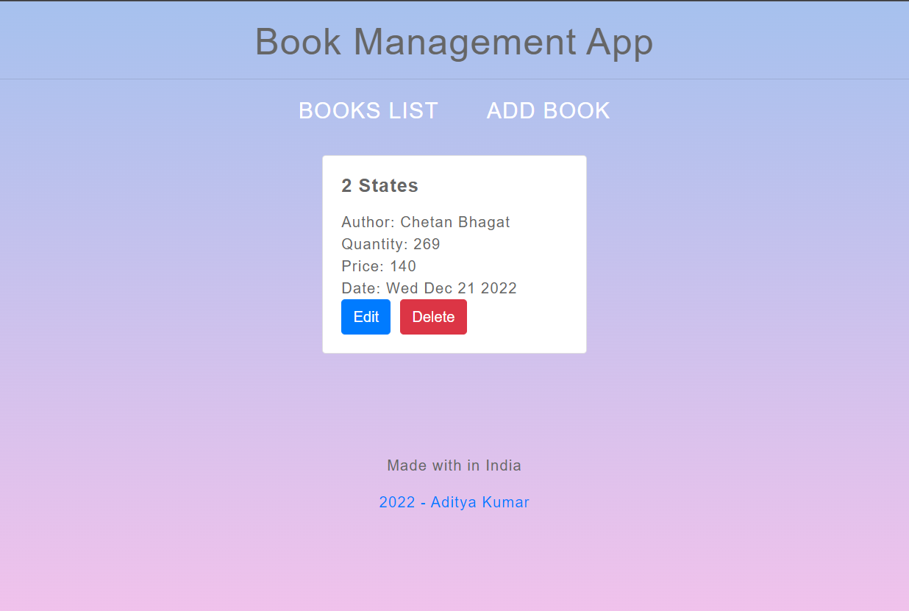

<h1 align ="center"><a href="#"> Book Management App</a> </h1>

## 📌 Introduction

This fully responsive App will help you to remember that what books would you love to read in your free time as well as in busy time.

<!-- ## 🚀 Visit Now -->

<!--  -->

<!-- <pre><center><a href="https://adityapal87.github.io/Random_Users/"><b>adityapal87.github.io/Random_Users/</b></a></center></pre> -->

## 👨‍💻 Tech Stack Used

-  React js
-  React Hooks / Custom Hooks
-  Context API
-  React Routers
-  JavaScript
-  Scss for Styling Component
-  uuid for gernerating a unique id
-  Bootstrap for Styling
-  lodash

## 🛠️ Installation Steps

Star and Fork the Repo 🌟 and this will keep us motivated.

1. Clone the repository

```bash
git clone https://github.com/adityapal87/Book_Management_App
```

2. Change the working directory

```bash
cd Book_Management_App
```

3. Install dependencies

```bash
npm install
```

4. Run the app

```bash
npm run start
```

## Screenshots

<center>
</img>
</center>
